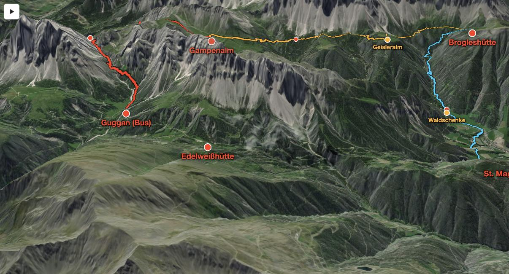
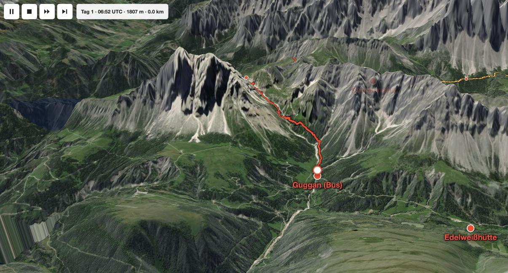

# vacation3d

3D hike maps for a WordPress blog: GPX tracks draped over real terrain and satellite imagery,
huts and named stops labelled, a "camera flight" that walks a dot along the route, and an
elevation profile. One Gutenberg block, one small plugin per vacation.



Camera flight, 20 s per day, with pause / stop / 2× / next day and a live HUD. The fullscreen
button (top right) takes the whole block fullscreen, which is the only sensible way on a phone:



Built on [MapLibre GL JS](https://maplibre.org) with free tiles and **no API keys**:
[Mapterhorn](https://mapterhorn.com) elevation, Esri World Imagery.

## Repository layout

```
clean_tool/clean_gpx.py     GPX -> data/<id>.js (cleaning, stop detection, naming of stops)
data/<id>.js                the committed track data of one vacation (tracks, breaks, interest_breaks)
raw/<id>/*.gpx              your original GPX files, GITIGNORED (timestamps = where you were, when)
src/core/                   the Gutenberg block: PHP registration + render, block.json, editor.js
src/assets/map.js, map.css  the map itself (also used by the demo page)
vacations/<id>.php          plugin main file of one vacation: header + camera, colours, labels
plugins/vacation-3d-map-<id>/   the assembled plugin folder, generated by build_plugin.sh
dist/*.zip                  the same as a zip for wp-admin upload, gitignored
demo/index.html             standalone page, same markup the block renders
```

## From GPX to plugin

```bash
# 1. drop the GPX files of the trip into raw/<id>/ and run the cleaner once to see the breaks
python3 clean_tool/clean_gpx.py --id vilnoess
#      break: day 2 10:06 UTC, 54 min, 2006 m
#      break: day 3 09:56 UTC, 28 min, 1387 m
# 2. name the breaks that matter (hut, lunch place); the rest stay small red dots
python3 clean_tool/clean_gpx.py --id vilnoess --name 2:54=Geisleralm --name 3:28=Waldschenke
# 3. assemble the plugin folder + zip
./build_plugin.sh vilnoess
```

The cleaner removes GPS jumps, collapses "standing around" (≥ 2 min within 15 m) into a
single point, drops micro-steps, simplifies with Douglas-Peucker (2.5 m) and median-smooths
the elevation. Typical result: 1400 raw points → 300 per day.

### Data model (`data/<id>.js`)

```js
window.VACATION3D_DATA["vilnoess"] = {
  tracks:          FeatureCollection<LineString [lon, lat, ele]>, one feature per day
                   (properties: day, date, dist_km, up_m, down_m, start, end),
  breaks:          FeatureCollection<Point>  unnamed pauses ≥ 10 min  -> small red dots with popup
  interest_breaks: FeatureCollection<Point>  pauses named via --name -> orange dot + label
};
```

Hut labels and the camera are **not** in the data but in the vacation's plugin file
(`vacations/<id>.php`, mirrored in `demo/index.html`): fixed coordinates or the start/end of a day.

## Preview locally

```bash
python3 -m http.server 8766
open http://localhost:8766/demo/index.html
```

## Deploy to the blog

Either upload `dist/vacation-3d-map-<id>.zip` in *wp-admin → Plugins → Upload*, or push the
folder over FTP with the music_blog tooling (health check + automatic rollback):

```bash
cd ../music_blog
.venv/bin/python -m musicblog.publish plugin-push \
    --source ../vacation3d/plugins/vacation-3d-map-vilnoess \
    --remote wp-content/plugins/vacation-3d-map-vilnoess
```

Activate once under *Plugins*. Then, in any post, add the block **Vacation 3D Map**
(category Embeds, or type `/vacation`), pick the vacation in the dropdown and set height and
zoom in the sidebar. Zoom 0 uses the vacation's default; a ~700 px wide post column wants
about 0.5 less than full screen.

## Adding a vacation

1. `raw/<newid>/` with the GPX files, run the cleaner as above → `data/<newid>.js`.
2. Copy `vacations/vilnoess.php` to `vacations/<newid>.php`; change the plugin name, the
   `$maps['<newid>']` key, camera (`overview`), colours and labels (`pois`).
3. `./build_plugin.sh <newid>`, deploy, activate. The block's dropdown now lists both.

Each vacation plugin ships the same `core/`; the first one to load registers the block
(`VACATION3D_CORE_LOADED`), the others skip it. When `src/core` or `src/assets` change,
rebuild and redeploy **every** vacation plugin.

## Things learned the hard way

- MapLibre 6 is ESM-only; the plugin uses the last UMD release (5.24.0) via `wp_enqueue_script`.
- A GeoJSON z coordinate is treated as absolute height since MapLibre 5, so the track ends up
  *below* exaggerated terrain. The map strips z and keeps elevation for the profile only.
- Changing zoom **and** pitch every animation frame on 3D terrain crashes the WebGL renderer
  after a few seconds. The camera flight eases to its zoom/pitch once and then only pans.
- The terrain looks flat until the DEM tiles have arrived (5–10 s cold). A banner says so.
- Two `raster-dem` sources, one for terrain, one for hillshade, or MapLibre complains.

## License

MIT, see [LICENSE](LICENSE). Map data: © Esri, Maxar, Earthstar Geographics (imagery),
© Mapterhorn (elevation), MapLibre GL JS (BSD-3).
